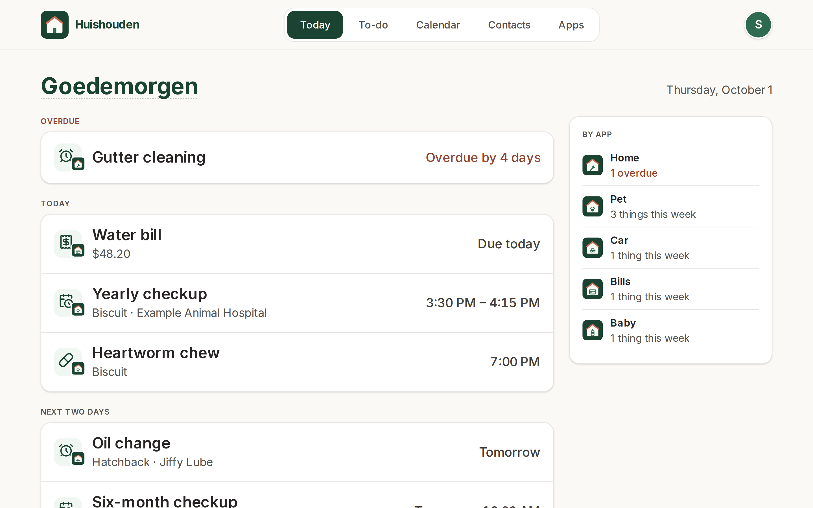
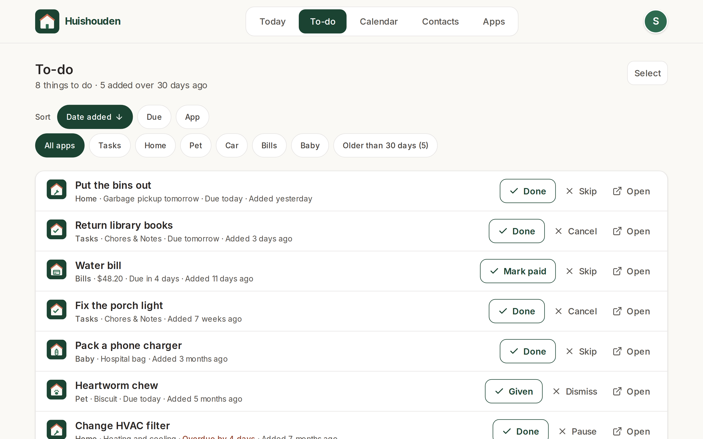
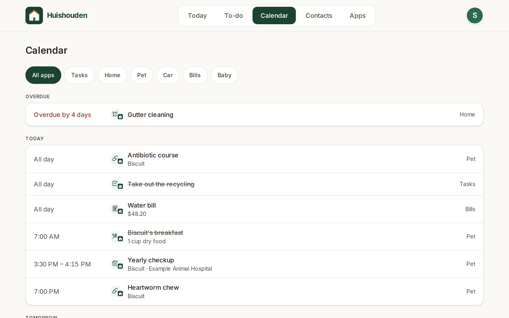
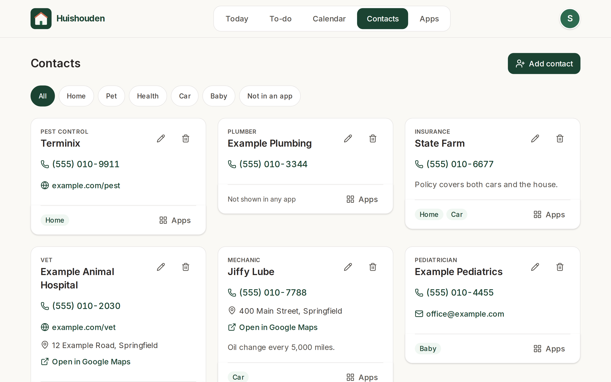
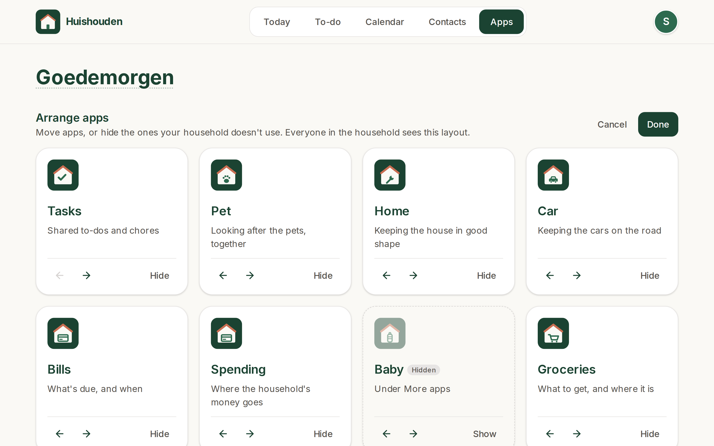
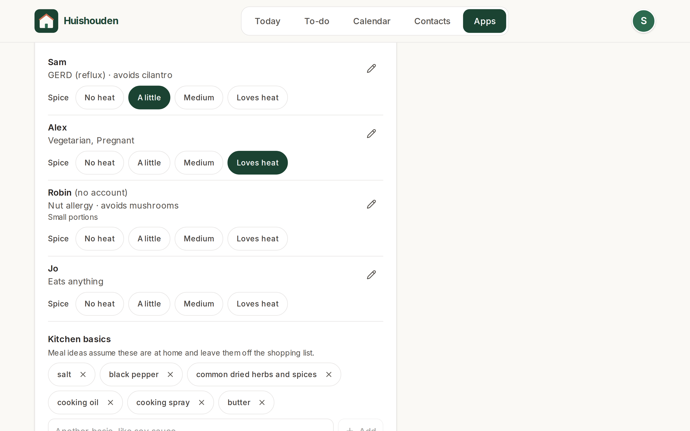

# Huishouden

The household's hub: one installable PWA with the day across every household app, the household's
calendar and contacts, and the apps themselves.



_Screenshots of the live site with invented data, refreshed by CI after each deploy._

| App | URL | Repo |
|---|---|---|
| Huishouden (this) | https://huishouden-piekstra.web.app | huishouden/portal |
| Every other app | `https://<site>.web.app` | `huishouden/<repo>`, listed in `apps.json` |

Every app follows [STANDARDS.md](STANDARDS.md). Each app is its own repo and its own Firebase Hosting site in project `huishouden-piekstra`.
Every app is listed once, in `apps.json`: the tiles come from it, `contactRoles` says which apps show
contacts (and the roles they offer), and `infra/apps.conf` reads it to provision hosting. Its order is
the default tile order: simple everyday apps first, Spending (which needs setup) after them, Baby (not
for every household) last.
`i18n.es` and `i18n.nl` give each app's name, description and contact roles in Spanish and Dutch
(contacts keep the English role; the hub shows it in the reader's language).

## Tabs

Members of a household get four tabs; everyone else sees Apps, with what Huishouden is and how to start.

| Tab | Shows |
|---|---|
| Today (`/today`, members' default) | The wall-tablet glance: overdue things first, then today's, then the next two days, from every app's items in `households/{id}/agenda` (`@huishouden/pwa-kit/agenda`, `todayItems`), plus the items for named people only that name the member (`personalAgenda`: "Medicine for Oma Ria"); one line per app with what is overdue and coming up this week. Each item opens its app. |
| To-do (`/todo`) | Every app's open things to do (`households/{id}/todos`, `@huishouden/pwa-kit/todos`): newest added first, or oldest, by due date or by app; filtered by app or to things added over 30 days ago. Each row has the app's own Done and Cancel (Pause, Skip, Mark paid…, Cancel confirmed, both with Undo) and Open; Select cancels several at once. Items for named people only (`personalTodos`, Health's medicines) show only to the members they name. Actions run in the source app's data as the signed-in member, so its rules decide; what a role can't do is left out. On phones the bottom bar is Today, To-do, Calendar, Apps, with Contacts under More. |
| Notifications (`/notifications`, in the account menu; every app's "Manage in Huishouden" opens it) | One push subscription per device for the whole suite (this portal's worker owns it; `PushSuiteUpgrade` also moves older per-app subscriptions to it without asking), with a test notification, and one switch per app (Pet, Health, Bills, Tasks, Home, Baby, Car) for the signed-in person (`notificationPrefs`; no Bills for helpers and kids, no Health for kids). |
| Calendar (`/calendar`) | Overdue items, then every day from today with something on it (`agendaDays`), filtered by app. |
| Contacts (`/contacts`) | Every household contact (`households/{id}/contacts`), whichever apps show it, grouped by role and tagged with its apps; added and edited with the kit's contact dialog. A new contact shows in no app (or in the app being filtered) until apps are chosen with Apps on its card. |
| Apps (`/apps`) | The Dutch greeting (the word explains itself on hover or tap), the tiles, and the household: start one, rename it, members with their own names and photos, invites with an email from the inviter's Gmail; and Food: who eats at home (every member, plus people without an account), their diets, allergies, foods to avoid and a note, and the kitchen basics recipes may assume, saved in `households/{id}/settings/food` (`@huishouden/pwa-kit/food`) for Groceries' meal ideas and later apps. |





## Tiles

A household's members can arrange its tiles (Arrange, under the tiles): move apps earlier or later,
or hide them. The layout is saved in `households/{id}/settings/portal` (`order` and `hidden`, app
repo names; rules in huishouden/rules), so every member sees it on every device. Apps the layout
doesn't mention, such as apps added later, follow the ordered ones in registry order. Hidden apps
stay one tap away under More apps. Signed-out visitors see the default.

On tablets each tile is a card with the app's description. On phones the tiles are a home-screen
grid (four across, three under 375px wide): the logo and name only, so every app fits on the first
screen; a long press on a tile, or "What's each app?", opens what each one is for. A tile's corner
shows how many of the app's things are overdue (from the agenda, as on Today). Below the tiles a
phone folds the household into rows (Members, Home, Currency, Connected assistants, In your own
calendar) and Food into its title, each opening in place; `/apps#household-members`, `-home` or
`-currency` opens one section, and `/apps#household` (apps link there to set the home) opens Home.





## Code

React 19, Tailwind v4 and the kit's UI (`@huishouden/pwa-kit/react/*`). `src/data/live.ts` turns
sign-in and Firestore into one `HubState` (`src/hub.ts`) and the actions that change it; the screens
only render that state. Tests can't sign in to Google, so the smoke and screenshot tests hand the app
invented state with `window.__hubPreview(state)` (`src/data/preview.ts`, `e2e/fixtures/hub.ts`);
its actions then change only that state in the tab, never Firestore.

## Privacy

Household data lives in the household's own Firestore documents, visible only to its members.
To catch problems early, the app sends reports to New Relic (free tier) through
`@huishouden/pwa-kit/observability`: errors (emails, ids, query strings and long numbers removed),
Core Web Vitals and page loads, the app version, device type, and the approximate location (country,
region, city, the network's map point) New Relic derives from the network address, kept 8 days; and anonymous usage counts per visit: `create household`, `invite member`, `send invite email`, `arrange apps`, `add contact`, `save food preferences`, and which tab is open. Households are counted by a
hash of the id. No names, emails, entries, free text or device location, and no cookie or stored
id: nothing links one visit to the next. When the browser sends Global Privacy Control or Do Not
Track, usage counts are skipped; errors and speed still go. Local builds, staging and
automated browsers send nothing. The page people see is
[huishouden-piekstra.web.app/privacy](https://huishouden-piekstra.web.app/privacy); details in pwa-kit
[docs/observability.md](https://github.com/huishouden/pwa-kit/blob/main/docs/observability.md).

## Develop

```sh
bun install
bun run env:pull # the public Firebase web config, into .env.local
bun run dev      # http://localhost:3001
bun run lint && bun run test && bun run build
BASE_URL=http://localhost:4173 bun run e2e   # against `bun run preview`
bun run icons    # after editing public/icon.svg
```

Staging is cleaned by whoever creates the mess, not by a schedule: the e2e and evidence runs delete
the households and users they create, and leftovers from cancelled runs are removed with the `hh`
command line (`hh ops staging-cleanup`). No workflow here runs on a timer to do it.

## Deploy

Merges to `main` deploy through `.github/workflows/ci.yml` using Workload Identity
Federation (repo variables `GCP_WIF_PROVIDER`, `GCP_DEPLOY_SA`). Pull requests only build.
The deploy also uploads the suite's hashed build files to the asset CDN (the Cloudflare Worker
`huishouden-assets`) with the repo secrets `CLOUDFLARE_API_TOKEN` and `CLOUDFLARE_ACCOUNT_ID`;
the variable `HH_ASSET_CDN=off` turns that off for the suite (pwa-kit docs/one-site.md "Asset CDN").
After an app's deploy, `hh ops deploy-site` runs this workflow with `reconcile: true`: it uploads the app's new build to the asset CDN (apps hold no Cloudflare token) and redeploys the site only if it is behind; otherwise it is a no-op.

## Monitoring

`.github/workflows/monitoring.yml` provisions New Relic for every app in `apps.json`: a Browser app
each, a ping monitor at each app's path on this site, alerts (emailed) and the **Huishouden**
dashboard. It runs the kit's `infra/newrelic.ts` at the version `package.json` pins, when
`apps.json` changes on `main`, every Monday (repairing anything changed by hand) and on demand:

```sh
gh workflow run monitoring.yml -R huishouden/portal                 # provision now
gh workflow run monitoring.yml -R huishouden/portal -f dry-run=true # only print what would change
```

The apps' browser settings (account id, app id, `NRJS-` browser key; public by design) are uploaded
to this repo's `observability` pre-release when they change, and every production deploy serves
them as `/hh-observability.json`; each app reads its own entry when it starts. No app repo holds New
Relic variables, and a new app reports from its first deploy without a rebuild.

Secrets on this repo: `NEW_RELIC_API_KEY` (a New Relic User key) and `ALERT_EMAIL`. Without them the
workflow skips with a notice. The key exists only in the secret.

Rotating the key:

1. one.newrelic.com > your name > API keys > Create a key, type User.
2. `gh secret set NEW_RELIC_API_KEY -R huishouden/portal` and paste it at the prompt.
3. `gh workflow run monitoring.yml -R huishouden/portal`, then `gh run watch -R huishouden/portal`.
4. Delete the old key in one.newrelic.com > API keys.

Details: pwa-kit [docs/observability.md](https://github.com/huishouden/pwa-kit/blob/main/docs/observability.md).

## License

Source available under [PolyForm Shield 1.0.0](LICENSE): you may use, study and modify this code
for any purpose except providing a product that competes with Huishouden.

Huishouden and its logo are the project's brand; please don't use them for other products.
